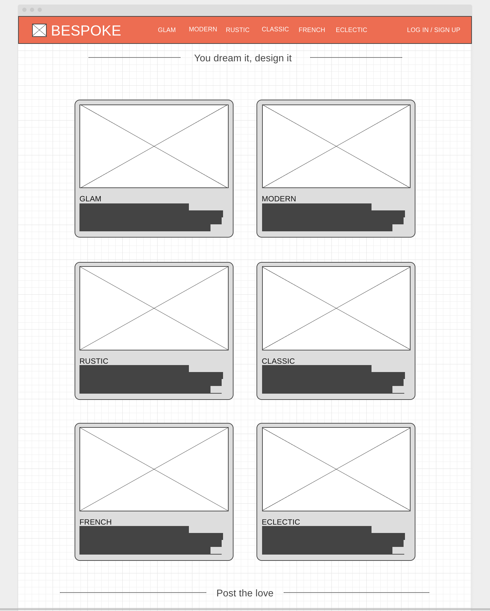
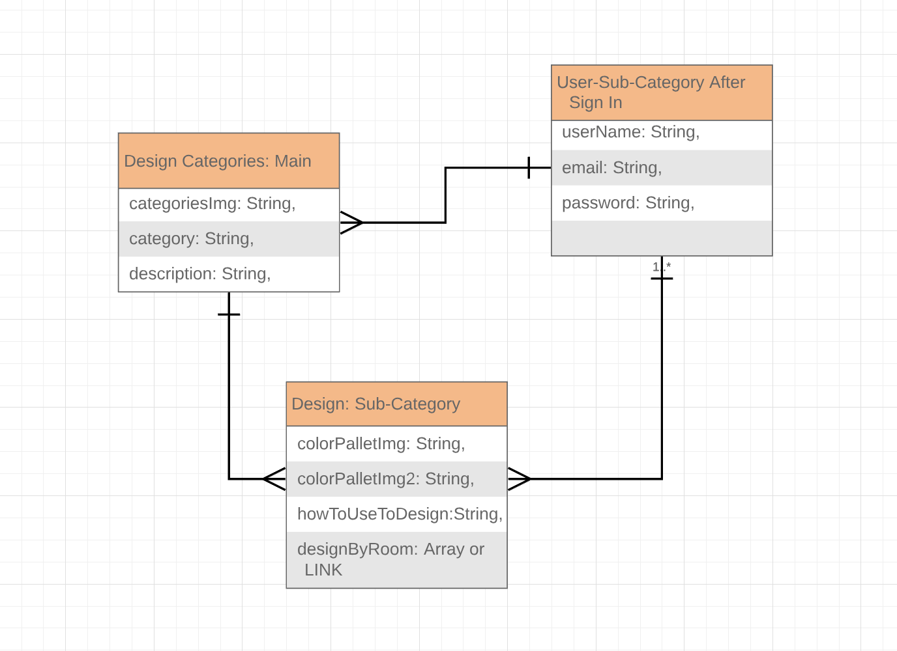

# BESPOKE

General Assembly WDI 20 - Project 2

- Project: https://nameless-plains-71844.herokuapp.com/
- Trello Board: https://trello.com/b/XEue3HLc/full-stack-app
- Git Hub: https://github.com/JessicaBPerez/Bespoke-App.git

## Overview

The goal of this project was to utilize our knowledge of the Mongo database, node packages, and libraries to build and style an interactive web application that permanently stores data in a database. We then render, create, edit, or delete new data to make our app interactive. My app is called "Bespoke." It is an interior design app that gives color pallet, furniture, and commerce suggestions and comments based on six pre-selected categories. Users also have the option to add their own interior design categories along with pictures, and descriptions. If users wish to be more specific, they can create "flairs." Flairs are creative design elements based on a specific flair category (i.e Princess room, Spiderman room, etc.) A user can personalize, edit, or delete their flair pages to ensure maximum flair personalization.

## Wireframes

Desktop Version

## ERD

## Technologies Used

1. Languages:

- CSS
- JavaScript

2. Libraries:

- Bootstrap

3. Frameworks/ Technologies:

- Node
- Express
- Mongo
- Mongoose
- hbs
- method-override
- dotenv
- morgan

4. Templates:

- Handlebars

## Future Developments/Improvements for Version 2

- Add user authentication that would allow users to save their designs to their account
- Reward system that allows users to accumulate points based on referrals and account creations to Bespoke.
- Implement a "redeem rewards" system where users can redeem their accumulated rewards for gift cards or other rewards.
- Design a children's section
